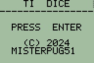
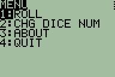
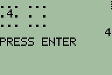
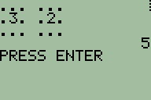

# TIDICE
TIDICE is a simple probability sim program written in TI-BASIC. This program allows you to roll one or two 6-sided virtual dice on your calculator. This program was made for the TI-82, TI-83, TI-83+, TI-84+, and TI-84+ CE, but it may run on other devices.

# Tested devices
**Calculator**|**ROM/OS Version**|**Real/emulated**
:-----:|:-----:|:-----:
TI-82|19.0|Real
TI-82|19.0|Emulated
TI-83|1.02|Emulated
TI-84 Plus|2.55MP|Emulated
TI-84 Plus CE|5.6.0.0020|Emulated
# Screenshots
 
Start Screen
#
 
Menu
#
 
Rolling one die
#
 
Rolling two dice
